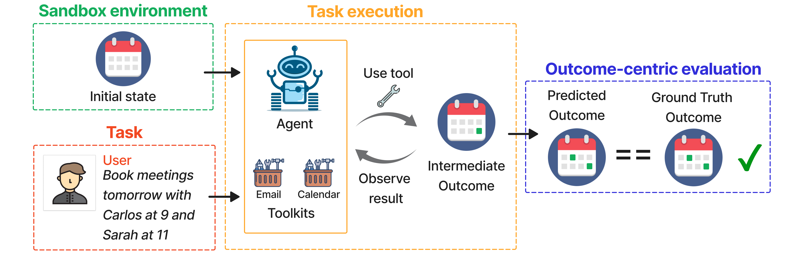

# WorkBench

WorkBench - the first open-source benchmark for evaluating agent performance on realistic workplace tasks. Created by [MindsDB](https://mindsdb.com/). 



## Installation

Python Version: 3.10.11

```bash
git clone https://github.com/olly-styles/WorkBench.git
cd WorkBench
python3 -m venv venv
source venv/bin/activate
pip install -r requirements.txt
```

## Usage

All five sandbox databases, task-outcome pairs, and pre-computed inference results are provided in the `data` directory.

### Evaluation

As all the pre-computed inference results are provided, you can reproduce the evaluation results in the paper without running inference. Use the following script to calculate the metrics.

```bash
python scripts/evals/calculate_all_metrics.py;
python scripts/evals/calculate_all_metrics.py --all_tools;
```

Not that results are not provided for the all_tools variant of GPT3.5 and LLama2-70B as the prompt does not fit into the context window for these models. 

### Data generation
All generated data is provided pre-computed in the `data` directory. If you want to generate the data yourself, follow the steps below.

```bash
python scripts/data_generation/mocked_data/generate_all_mocked_data.py;
python scripts/data_generation/query_answer_generation/generate_all_queries_and_answers.py;
```


### Inference

Pre-computed inference results are provided in the `data` directory. If you want to run inference yourself, you will need to provide your own API keys.

- An openai key is required for GPT-3.5 and GPT-4. 
- An anthropic key is required for Claude-2.
- An anyscale key is required for llama2-70b and mistral-8x7B.


```bash
touch openai_key.txt && echo YOUR_OPENAI_API_KEY > openai_key.txt
touch anthropic_key.txt && echo YOUR_ANTHROPIC_API_KEY > anthropic_key.txt
touch anyscale_key.txt && echo YOUR_ANYSCALE_API_KEY > anyscale_key.txt
```

#### Run inference for specific domain and model
```bash
python scripts/inference/generate_results.py --model_name MODEL_NAME --queries_path QUERIES_PATH
```

#### Run inference for all domains and models 
```bash
python scripts/inference/generate_all_results.py
```

#### Run inference for a new agent

Getting results for a new agent dependings on the how different the new agent is from existing agents. Here we go through three possible scenarios:

1. If the new agent is the same as an existing agent with a different prompt, you can modify the [prompt directly](https://github.com/olly-styles/WorkBench/blob/bf1ed266770d40b544472f6335e8d366e552e4b8/src/evals/utils.py#L690). 
2. If the new agent uses an LLM that's supported by LangChain but not by the current implementation, then the new agent can be added to the [supported LLMs](https://github.com/olly-styles/WorkBench/blob/bf1ed266770d40b544472f6335e8d366e552e4b8/src/evals/utils.py#L638)
3. To implement a new agent outside of the LangChain framework, update the [inference loop](https://github.com/olly-styles/WorkBench/blob/bf1ed266770d40b544472f6335e8d366e552e4b8/src/evals/utils.py#L676)


### FAQ

#### What are "queries" and "answers"?
We originally called tasks "queries" and outcomes "answers". We updated the terminology in the paper but have not yet updated the code.

#### What is "mocked data"?
Similar to the "queries" and "answers" terminology, we originally called the sandbox databases "mocked data". We updated the terminology in the paper but have not yet updated the code.

#### Can I contact the authors?
Yes! The fastest way to reach us is by opening an issue on this repository. If you want to reach out for any other reason, please send an email to ollystyles@gmail.com