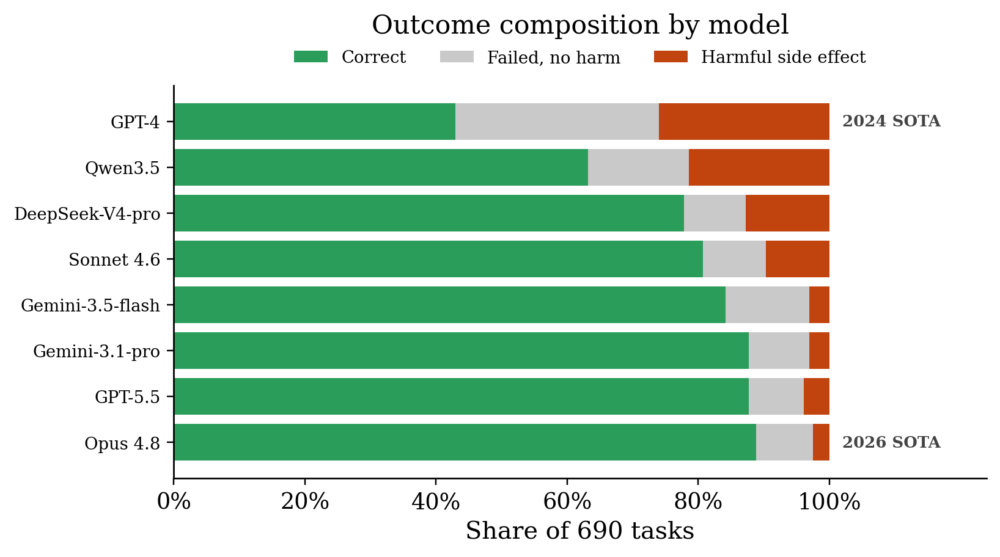
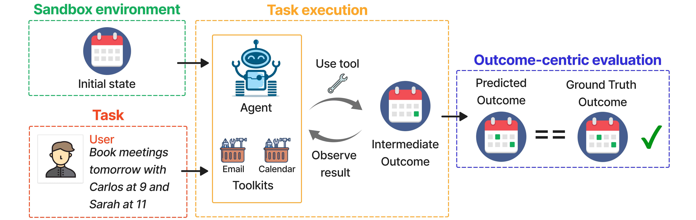

# WorkBench

## WorkBench Revisited (2026)

[**WorkBench Revisited**](retro/main.pdf) re-evaluates 24 models released between 2023 and 2026.



**Outcome composition by model.** Each model's 690 WorkBench tasks split into correct, failed-but-harmless, and harmful side effect, ordered by task completion. GPT-4 is the original 2024 result; the others are 2026 runs.

The best agent on WorkBench in March 2024, GPT-4, completed 43% of tasks and took an unintended harmful action on 26% of them. In June 2026 the best agent, Claude Opus 4.8, completes 89% and takes a harmful action on just 2.5%. Three things stand out:

- **Capability and safety go together** rather than trade off — the models that finish the most tasks also do the least unintended damage.
- **Basic mistakes persist.** Several classes of error have been eliminated, but frontier models still occasionally cause irreversible harm, such as sending an email to the wrong person.
- **Open-weight models have collapsed costs** for a performance level that was previously only accessible to proprietary models, while frontier costs have stayed relatively stable.

The 2026 release also includes data and code quality improvements, new model scores, and analysis of agent progress since 2024. Read the full write-up in [`retro/main.pdf`](retro/main.pdf).

All 2026 per-task results are committed under `data/results/` (gzipped CSVs plus `_meta.json` sidecars), and every figure in `retro/figs/` reads its numbers from [`retro/data/model_results.json`](retro/data/model_results.json), which [`scripts/evals/generate_results_summary.py`](scripts/evals/generate_results_summary.py) derives from those results via the same scoring pipeline as `workbench-evaluate`. No correctness or safety number is hand-maintained; the dollar costs in the cost figure are estimated from run traces by [`scripts/evals/estimate_model_costs.py`](scripts/evals/estimate_model_costs.py) (traces are not committed for size reasons).

## About WorkBench

WorkBench - the first open-source benchmark for evaluating agent performance on realistic workplace tasks. Created by [MindsDB](https://mindsdb.com/). Special thanks to Jorge Torres, Adam Carrigan, and the rest of the MindsDB team for their support. Check out the paper here - https://arxiv.org/abs/2405.00823



**Figure 1: The WorkBench pipeline.** Tasks are generated from templates over five sandbox databases, executed by an agent with 26 read/write tools, and graded by comparing the sandbox's final state against the ground truth.

## Installation

Requires Python 3.12+ and [uv](https://docs.astral.sh/uv/).

```bash
git clone https://github.com/olly-styles/WorkBench.git
cd WorkBench
uv sync --frozen
```

## Usage

All five sandbox databases, task-outcome pairs, and pre-computed inference results are provided in the `data` directory. Three console scripts are registered by `pyproject.toml` and can be invoked via `uv run`:

| Script | Purpose |
| --- | --- |
| `workbench-evaluate` | Compute metrics over existing results in `data/results/` |
| `workbench-inference` | Run a model against a task file and write a fresh results CSV |
| `workbench-generate-data` | Regenerate sandbox databases and task/outcome pairs from scratch |

Batch and analysis scripts (multi-model inference runs, cost estimates, plotting) live in `scripts/`.

### Evaluation

All pre-computed inference results are committed under `data/results/`, so the evaluation numbers in the paper can be reproduced without running inference.

```bash
uv run workbench-evaluate
uv run workbench-evaluate --all_tools
```

Note that results are not provided for the `all_tools` variant of GPT3.5 and LLama2-70B as the prompt does not fit into the context window for these models.

Ground truth is versioned: the original March 2024 runs are scored against the pre-correction snapshot in `data/processed/tasks_and_outcomes/v1/`, while current runs use the top-level `data/processed/tasks_and_outcomes/` files (v2, which include the 2026 ground-truth corrections). `workbench-evaluate` picks the right version per results file from the `ground_truth_version` field in its `_meta.json` sidecar; runs without a sidecar predate the corrections and default to v1. This keeps published numbers reproducible after ground-truth fixes.

### Data generation

All generated data is committed under `data/`. Regenerating overwrites the committed files, so the command requires `--force`:

```bash
uv run workbench-generate-data --force
```

This regenerates the five sandbox databases (`data/processed/*.csv`) and the per-domain task/outcome files (`data/processed/tasks_and_outcomes/*.csv`).

### Inference

Pre-computed inference results are provided in the `data` directory. To run inference yourself, you need an [OpenRouter](https://openrouter.ai/) API key. All LLM calls use the OpenAI-compatible chat-completions API, so no provider-specific SDKs are required.

Create a `.env` file in the project root:

```bash
OPENROUTER_API_KEY=your-openrouter-key
# Optional — direct-provider keys. When present, a model's native provider is
# used directly so calls bill that vendor's credits instead of OpenRouter.
OPENAI_API_KEY=your-openai-key
ANTHROPIC_API_KEY=your-anthropic-key
GEMINI_API_KEY=your-google-key
```

**Routing.** Each model has a native provider (OpenAI, Anthropic, Google, or OpenRouter). If that provider's direct key is set, the call goes straight to the vendor (`api.openai.com`, `api.anthropic.com`, Gemini's OpenAI-compatible endpoint) and bills its credits; otherwise it falls back to OpenRouter with `OPENROUTER_API_KEY`. OpenRouter-only models (Qwen, Llama, Mixtral) always use OpenRouter. The chosen route is logged at the start of each run and recorded in the run's `_meta.json` (`provider`, `base_url`, `model_id`).

#### Run inference for a specific model and task file

```bash
uv run workbench-inference \
    --model_name claude-sonnet-4.6 \
    --tasks_path data/processed/tasks_and_outcomes/email_tasks_and_outcomes.csv
```

Useful flags:

- `--tool_selection {all,domains}` — pass every tool to the model on every task (`all`, default) or only the tools relevant to the task's domain (`domains`).
- `--workers N` — number of parallel workers; tasks are dispatched via a thread pool, with per-thread sandbox state.
- `--structured_outputs` — use the model's native tool-calling API instead of ReAct text parsing.
- `--act_without_confirmation` — append a system-prompt suffix telling the model to act without asking the user to confirm.
- `--log_traces` — also write the full per-task LLM trace as JSON alongside the results CSV.
- `--resume` — resume the most recent matching run: keep rows with an empty error and only re-run missing or errored tasks.

The available model names are the keys of `MODEL_REGISTRY` in [`src/evals/agent.py`](src/evals/agent.py). Current entries include `claude-fable-5`, `gpt-5.4`, `gpt-5-nano`, `claude-sonnet-4.6`, `gemini-3-flash`, `gemini-2.5-flash`, `gemini-3.1-flash-lite`, `qwen-3.5-flash`, `deepseek-v4-pro`, `mistral-small-2603`, `mistral-medium-3-5`, plus the original-paper models (`gpt-4`, `gpt-3.5`, `claude-2`, `llama2-70b`, `mixtral-8x7b`).

#### Run inference for all domains and models

```bash
uv run scripts/inference/generate_all_results.py
```

#### Run inference for a new agent

The agent layer was rewritten to call OpenRouter directly (no LangChain). To experiment with a new agent there are three entry points, all in [`src/evals/agent.py`](src/evals/agent.py):

1. **Different prompt, same agent** — edit `PREFIX`, `SUFFIX`, or `ACT_WITHOUT_CONFIRMATION_SUFFIX`, or change `build_system_prompt`.
2. **New model** — add an entry to `MODEL_REGISTRY` mapping a friendly name to a `ModelConfig(model_id, supports_temperature, provider)` whose `model_id` is the OpenRouter slug (e.g. `openai/...`) and whose `provider` is `openai`, `anthropic`, `google`, or `openrouter`. Direct providers strip the slug prefix automatically; see "Routing" above.
3. **A different agent loop entirely** — implement an alternative to `run_agent` (ReAct text parsing) or `run_agent_structured` (native tool calling) and dispatch to it from `src/evals/inference.py:_run_single_task`.

### Development

Install pre-commit hooks to run linting, formatting, type checking, and tests automatically before each commit:

```bash
uv run pre-commit install
```

### FAQ

#### Can I contact the authors?
Yes! The fastest way to reach us is by opening an issue on this repository. If you want to reach out for any other reason, please send an email to ollystyles@gmail.com

#### Where's the paper?
https://arxiv.org/abs/2405.00823

The 2026 follow-up, [WorkBench Revisited](retro/main.pdf), re-runs the benchmark on 21 newer models.
